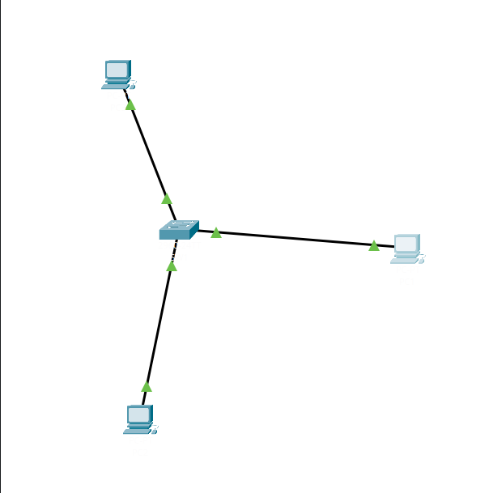
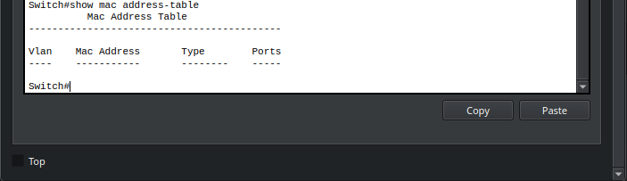
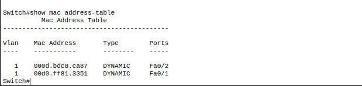
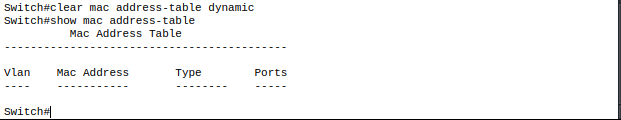

# LAB 2.1 REPORT
## MAC Address Table Learning on Cisco 2960 Switch

**Date:** 02/13/2026 
**Topology:** 1x 2960 Switch + 3x PCs  

---

## Topology Diagram



**IP Addressing Scheme:**
| Device | Interface | IP Address | Subnet Mask |
|--------|----------|------------|-------------|
| PC1 | NIC | 192.168.1.10 | 255.255.255.0 |
| PC2 | NIC | 192.168.1.20 | 255.255.255.0 |
| PC3 | NIC | 192.168.1.30 | 255.255.255.0 |

---

## Lab Observations

### **Task 1: Initial MAC Table State**

**Command Used:**
```
Switch# show mac address-table
```

**Output:**



**Observation:** *MAC table is empty. No dynamic entries present.*

---

### **Task 2: Learn Multiple MAC Addresses**

**Action:** From PC1, ping PC2
```
PC1> ping 192.168.1.20
```

**MAC Table After Action:**



**Observation:** *Two MAC entries now present: PC1 on Fa0/1 and PC2 on Fa0/2.*

---

### **Task 3: Clear MAC Address Table**

**Action:** Clear dynamic MAC entries
```
Switch# clear mac address-table dynamic
```

**MAC Table After Clear:**


**Observation:** *All dynamic entries removed. Switch has "forgotten" all MAC addresses.*

---

## After completing this lab, I can:

- [x] Access switch CLI via Packet Tracer
- [x] Enter privileged EXEC mode (`enable`)
- [x] View MAC address table (`show mac address-table`)
- [x] Interpret MAC table output
- [x] Clear dynamic MAC entries
- [x] Explain how switches learn MAC addresses

---
